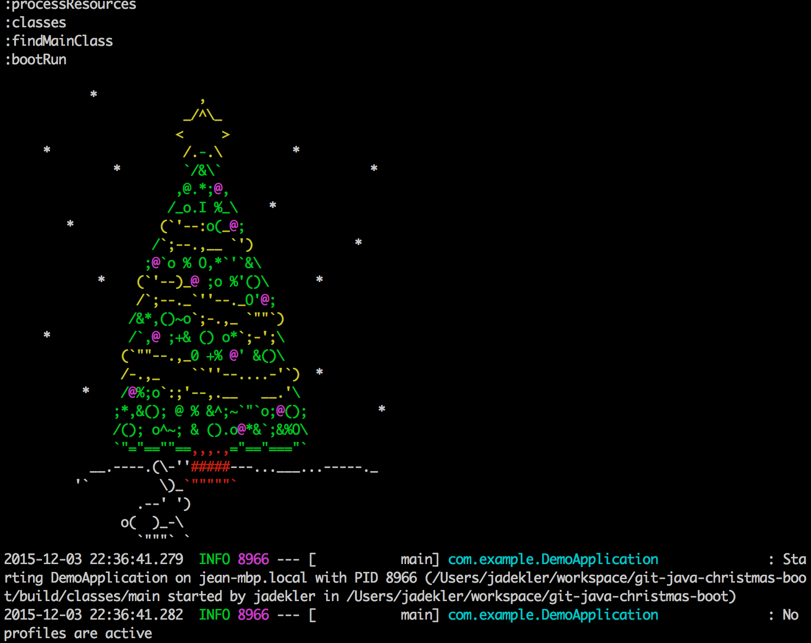

# git-java-christmas-boot
Upgrade your application initialization with a festive christmas
tree, using [spring-boot 1.3's banner customization](https://docs.spring.io/spring-boot/docs/current/reference/html/boot-features-spring-application.html)!

## Running

1. `./gradlew clean assemble bootRun`

## Notes

[ASCII image credit](http://www.chris.com/ascii/index.php?art=holiday/christmas/trees)